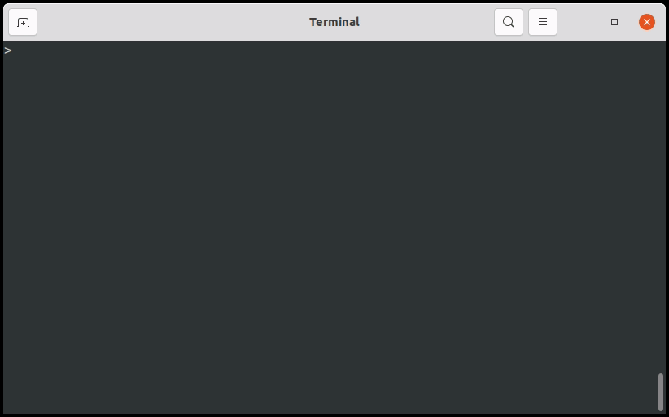

# sanscript-cli

A CLI for indic script transliteration based on [indic-transliteration](https://pypi.org/project/indic-transliteration/) python library.

Visit the [library's homepage](https://github.com/sanskrit-coders/indic_transliteration) for more information.

## Demo

<p align="center">
  
</p>

## Supported scripts/schemes

**Note**: Refer the [library's documentation](https://github.com/sanskrit-coders/indic_transliteration) for the latest information on the supported scripts/schemes.

- Brahmic scripts:

  - devanagari
  - gujarati
  - gurmukhi
  - gunjala_gondi
  - kannada
  - malayalam
  - tamil
  - grantha
  - telugu
  - bengali
  - oriya

- Romanizations:
  - hk
  - velthuis
  - optitrans
  - itrans
  - iast
  - kolkata
  - slp1
  - wx
  - titus

## Installation

Download the wheel file from the [releases](https://github.com/vipranarayan14/sanscript-cli/releases) page and use [`pip` to install](https://pip.pypa.io/en/latest/user_guide/#installing-from-wheels).

```console
$ pip install -U sanscript_cli-xxx.whl
```

## Usage

**Note**: Refer `sanscript --help` for the latest information.

```console
$ sanscript [OPTIONS] [INPUT_STRING]
```

**Arguments**:

- `[INPUT_STRING]`:  
  Input string to transliterate from the given '--from' scheme to the given '--to' scheme.  
  **Note:** This input will be ignored if '--input-file' option is specified.

**Options**:

- `-f, --from TEXT`: [required]  
  Name of the scheme FROM which the input is to be transliterated.
  See supported schemes list given above.
- `-t, --to TEXT`: [required]  
  Name of the scheme TO which the input is to be transliterated.
  See supported schemes list given above.
- `-i, --input-file FILENAME`:  
  Input file path to transliterate.  
  **Note**: When this option is used, input from the `INPUT_STRING` argument will be ignored.

- `-o, --output-file FILENAME`:  
  Output file path to write transliterated output.  
  **Note**: If it is not specified or its argument is '-', the output is written to Standard Output.

**Other options**:

- `--install-completion`: Install completion for the current shell.
- `--show-completion`: Show completion for the current shell, to copy it or customize the installation.
- `--help`: Show this message and exit.

## Examples

### Input options

- From command's argument

  Example:

  ```console
  $ sanscript --from hk --to iast "rAmAyaNa"
  ```

  Output: `rāmāyaṇa`

- From file passed to '--input-file / -i' option

  Example:

  ```console
  $ sanscript --from hk --to iast -i ramayana.txt
  ```

  Output: `rāmāyaṇa`

- From Standard Input using '-'

  Example:

  ```console
  $ cat ramayana.txt | sanscript --from hk --to iast -i -
  ```

  OR:

  ```console
  $ sanscript --from hk --to iast -i - < ramayana.txt
  ```

  Output: `rāmāyaṇa`

### Output options

- To Standard Output

  Example:

  ```console
  $ sanscript --from hk --to iast "rAmAyaNa"
  ```

  OR:

  ```console
  $ sanscript --from hk --to iast "rAmAyaNa" -o -
  ```

  Output: `rāmāyaṇa`

- To file passed to '--ouput-file / -o' option

  Example:

  ```console
  $ sanscript --from hk --to iast "rAmAyaNa" -o output.txt
  ```

  Output: `Output written to: /home/user/output.txt`

## License

MIT

## Credits

The program is based on [sanskrit-coders's](https://github.com/sanskrit-coders) [indic-transliteration](https://pypi.org/project/indic-transliteration/) library -- a python library for transliterating between various indic scripts and romanization schemes.

The program is built using [Typer](https://typer.tiangolo.com/) -- a python library for creating CLI apps quickly.
